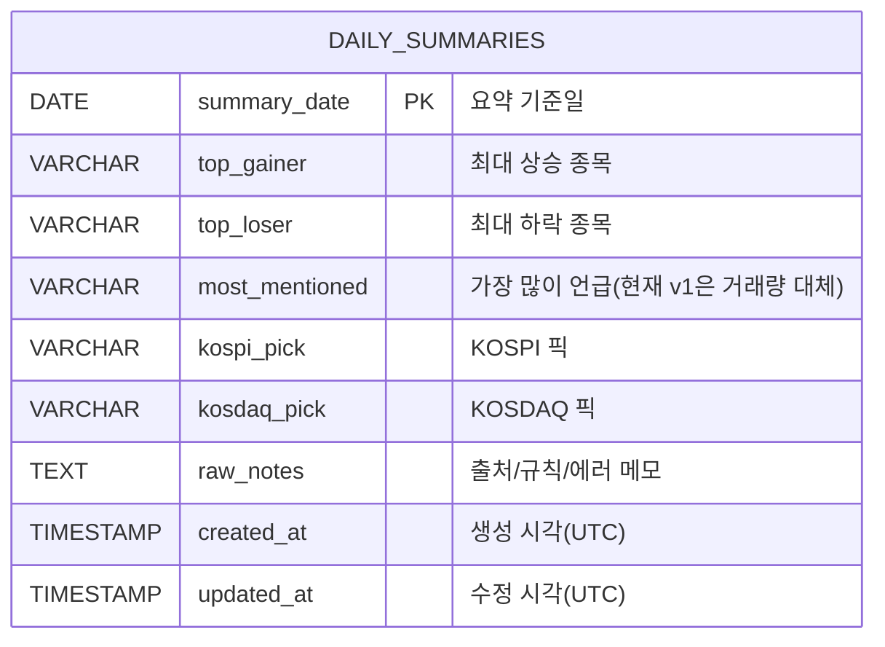

# ERD (kr-stock-daily-brief)

최종 업데이트: 2026-02-16

---

## ERD 다이어그램 (Mermaid)

---

## 설계 메모

- 현재는 단일 핵심 테이블(`daily_summaries`)만 사용.
- 1일 1행 구조 (`summary_date` PK)로 누적 저장.
- 생성 API는 upsert 동작이라 동일 날짜 재생성 시 `updated_at`만 갱신 가능.
- 추후 확장 예정(선택):
  - `data_sources` (원천 데이터 추적)
  - `generation_jobs` (배치 이력/에러 로그)
  - `mentions_raw` (most mentioned 고도화용 원천)
