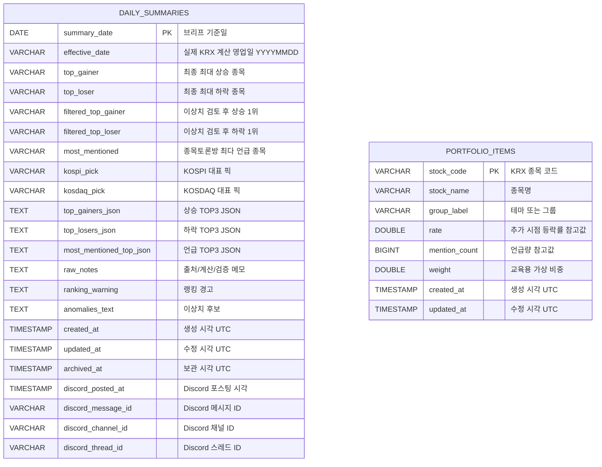
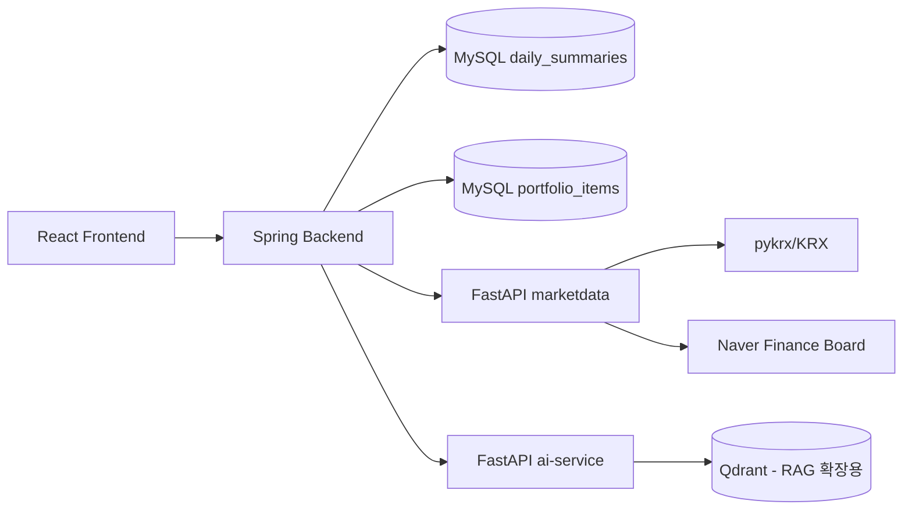

# ERD (kr-stock-daily-brief)

최종 업데이트: 2026-05-05

---

## ERD 다이어그램 (Mermaid)

---

## 외부/비영속 구성요소

---

## 설계 메모

- 핵심 영속 테이블은 현재 `daily_summaries`, `portfolio_items`다.
- 종목 차트와 이벤트는 저장하지 않고 요청 시 pykrx OHLCV 기반으로 조회/계산한다.
- 포트폴리오 샌드박스는 실계좌 연동 없이 `portfolio_items`에 교육용 가상 비중만 저장한다.
- Qdrant는 RAG 인덱싱 확장용으로 준비되어 있으며, 현재 MySQL ERD와 직접 FK 관계는 없다.
- 추후 확장 후보:
  - `stock_events` (이벤트 캐시/근거 링크 저장)
  - `watchlist_items` (로그인 도입 시 사용자별 관심 종목 저장)
  - `ai_chat_logs` (비식별 AI 품질 개선 로그)
